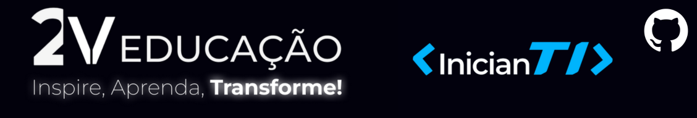

# 2V Educação - Projetos Inovadores de Educação em Tecnologia

Bem-vindo ao repositório oficial da 2V Educação no GitHub! Aqui, você encontrará informações valiosas sobre nossos projetos, com destaque para o inicianTI, um programa dedicado ao ensino de programação, e o SyTi, um projeto focado no desenvolvimento de sites para clientes.

## Sobre a 2V Educação

A 2V Educação é uma empresa comprometida com a transformação educacional, especialmente no campo da tecnologia. Buscamos empoderar indivíduos por meio da capacitação em habilidades tecnológicas essenciais. Acreditamos que a educação é a chave para impulsionar a inovação e moldar o futuro.

## Projetos

### inicianTI

O inicianTI é um programa educacional projetado para introduzir pessoas de todas as idades ao fascinante mundo da programação. Nosso objetivo é tornar o aprendizado de linguagens de programação acessível e envolvente. Este repositório contém recursos, exercícios e projetos práticos que auxiliam no desenvolvimento de habilidades fundamentais em programação.

#### Como Contribuir

- Faça um fork deste repositório.
- Implemente melhorias ou adicione novos recursos.
- Envie um pull request descrevendo suas alterações.

### SyTi - Sistemas Web para Todos

O SyTi é um projeto inovador que combina aprendizado prático com a entrega de soluções reais. Nosso time SyTi trabalha com clientes para desenvolver sites eficientes e visualmente atraentes. Este repositório contém os códigos-fonte de projetos passados e atuais, bem como documentação para facilitar o desenvolvimento colaborativo.

#### Como Contribuir

- Faça um fork deste repositório.
- Explore as issues abertas e atribua a si mesmo ou crie uma nova issue.
- Trabalhe na implementação e envie um pull request quando estiver pronto.

## Comunidade

Participe da nossa comunidade no Discord! [Link para o Discord da 2V Educação](https://discord.gg/a7R8vaGUpA). Lá, você poderá interagir com outros alunos, fazer perguntas, compartilhar suas experiências e se envolver ainda mais com os nossos projetos.

## Como Contribuir

Agradecemos contribuições de todos os níveis de habilidade. Se você é novo na programação ou é um desenvolvedor experiente, há sempre espaço para colaboração. Contribuir é fácil:

1. Faça um fork do repositório.
2. Clone o fork para a sua máquina local.
3. Implemente suas melhorias ou correções.
4. Envie um pull request com uma descrição clara das alterações.

## Contato

Fique à vontade para entrar em contato conosco através do nosso [site oficial](https://www.2veducacao.com.br) se tiver dúvidas, sugestões ou se quiser se envolver mais de perto com nossos projetos.

Agradecemos por fazer parte da comunidade 2V Educação!

**Juntos, estamos moldando o futuro por meio da educação em tecnologia.**

